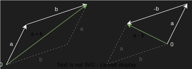
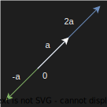

## 向量

+ [加减法](#加减法)
+ [数乘（标量乘法）](#数乘（标量乘法）)
+ [点乘（内积、数量积）](#点乘（内积、数量积）)

### 加减法

$$
设 \quad \vec{a} = \begin{bmatrix}
1 \\ 
2 \\
\end{bmatrix}, \space\space\space\space \vec{b} = \begin{bmatrix}
3 \\ 
1 \\
\end{bmatrix}
$$
$$
则 \quad \vec{a} + \vec{b} = 
\begin{bmatrix}
1 \\ 
2 \\
\end{bmatrix}
 +
\begin{bmatrix}
3 \\ 
1 \\
\end{bmatrix}
= 
\begin{bmatrix}
1 + 3 \\ 
2 + 1 \\
\end{bmatrix}
=
\begin{bmatrix}
4 \\ 
3 \\
\end{bmatrix}
$$
$$
则 \quad \vec{a} - \vec{b} = 
\begin{bmatrix}
1 \\ 
2 \\
\end{bmatrix}
 -
\begin{bmatrix}
3 \\ 
1 \\
\end{bmatrix}
= 
\begin{bmatrix}
1-3 \\ 
2-1 \\
\end{bmatrix}
=
\begin{bmatrix}
-2 \\ 
1 \\
\end{bmatrix}
$$
$$
即 \quad \vec{a} \pm \vec{b} = 
\begin{bmatrix}
a_1 \\ 
a_2 \\
\dots
\end{bmatrix}
\pm
\begin{bmatrix}
b_1 \\ 
b_2 \\
\dots
\end{bmatrix}
$$

### 数乘（标量乘法）

$$
k\vec{v} = k
\begin{bmatrix}
v_1 \\ 
v_2 \\
...
\end{bmatrix}
=
\begin{bmatrix}
kv_1 \\ 
kv_2 \\
...
\end{bmatrix}
,\quad k \in R
$$

###  点乘（内积、数量积）

$$
\vec{a} \bullet \vec{b} =
\begin{bmatrix}
a_1 \\ 
a_2 \\
...
\end{bmatrix}
\bullet
\begin{bmatrix}
b_1 \\ 
b_2 \\
...
\end{bmatrix}
=
\sum_{i=1}^{n}a_ib_i

$$
$$
\vec{a} \bullet \vec{b} =

$$
